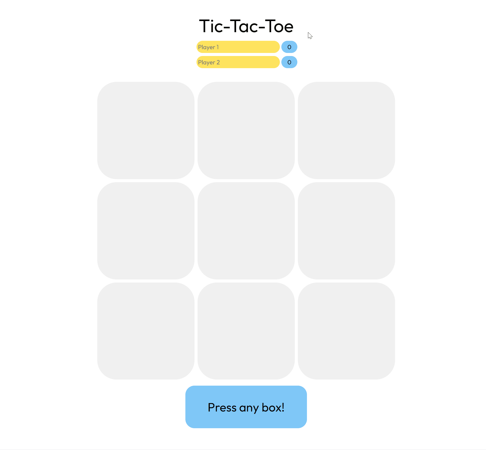

# tic-tac-toe

### Purpose
The purpose of this project is to reinforce modular programming while interacting with the DOM and GUI elements. To overcome this, I first started developping for the console, in a similar fashion to other traditional terminal apps, and then built the DOM interactions on top; this drastically simplified the process which otherwise stumped me while learning to develop for the web.

### Demo

Try out the live demo [here](https://justinleski.github.io/tic-tac-toe/).

### Challenges Faced
#### Async Functions
- While testing values, I found that my `console.log` statements seemed to be async to the order of the code as I tried to call functions to see if they worked properly. `console.log` would always show the final result of my functions despite being placed in between them. This originally lead to confusion, but with minor testing I was able to find out that it may be async.

#### Modularity
- Coding in modules is easy to understand, but hard to master. I found many cases where I had to refactor code that was not entirely independent as I wanted to alter/change a function or invoke it in a way that the module would not allow.
- Undefiend references happened a lot; it was tricky figuring out why I could not access members of my factory function.
- My code while in modules still left a lot to be desired on the stage of implementing DOM manipulation. I found it a significant challenge to figure out where and when certain elements are being manipulated despite being sectioned off into IIFE. There was a lot of dependency on some modules which caused me to spend a good portion of time tracking the code as I was unsure if some function inadvertently modified something twice or updated a value where it did not make sense to.

#### Validation
- Taking user input and checking if it is in an empty spot posed tricky for the second player. My issue was that I tried to take an input as a string, then split and parse it rather than taking two inputs - similar to a button. When attempting to split the two inputs the second would end up as an index outside of the array which caused issues for obvious reasons. Note that this issue was faced while developping for the console; thinking of how this game would be interacted with in a GUI provided more clarity and easier to read code plus reduced this issue.

#### `forEach()`
- The `forEach()` function cannot be broken in JavaScript. Since `forEach()` runs another function callback on each item in the array, the loop does not terminate with a single return statement.
- This functionality of the function made checking for win conditions initially very confusing. After debugging, it became clear that the loop did not terminate after the first return; looking into the documentation, it is clear to see that `forEach()` was not the proper implementation of my desired outcome due to the nature of callbacks.

#### DOM Manipulation
- Moving the game from the console to the DOM posed many challenges. Mainly adding the interactions between button presses and keeping track of the score and current turn of a player. This has taught me that perhaps my code was not modular enough as it posed a significant challenge as many new functions had to be introduced or reworked to accomodate the DOM.